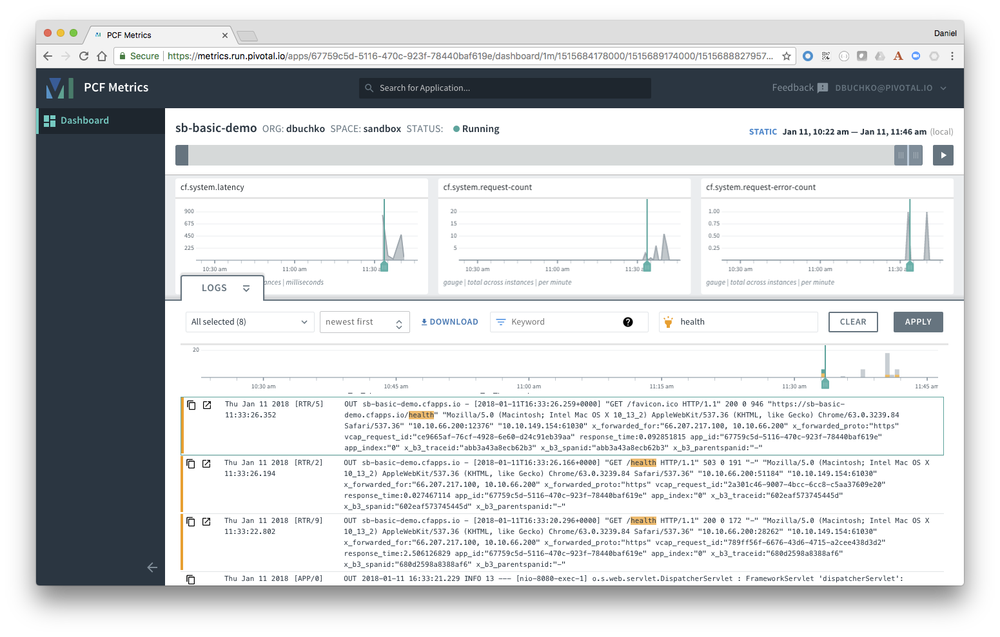

= PACE Ops Friendly Apps Workshop

The purpose of this workshop is to demonstrate how Spring Boot can help with monitoring applications.

== Enable Actuator

. Open the project `pom.xml` file, and verify it includes the `spring-boot-starter-actuator` dependency:

+
.pom.xml
[source,xml]
----
		<dependency>
			<groupId>org.springframework.boot</groupId>
			<artifactId>spring-boot-starter-actuator</artifactId>
		</dependency>
----

+
The resulting complete `pom.xml` should have the following content:

+
.pom.xml
[source,xml]
----
<?xml version="1.0" encoding="UTF-8"?>
<project xmlns="http://maven.apache.org/POM/4.0.0" xmlns:xsi="http://www.w3.org/2001/XMLSchema-instance"
	xsi:schemaLocation="http://maven.apache.org/POM/4.0.0 http://maven.apache.org/xsd/maven-4.0.0.xsd">
	<modelVersion>4.0.0</modelVersion>

	<groupId>io.pivotal.pace</groupId>
	<artifactId>sb-basic-demo</artifactId>
	<version>0.0.1-SNAPSHOT</version>
	<packaging>jar</packaging>

	<name>sb-basic-demo</name>
	<description>Demo project for Spring Boot</description>

	<parent>
		<groupId>org.springframework.boot</groupId>
		<artifactId>spring-boot-starter-parent</artifactId>
		<version>1.5.9.RELEASE</version>
		<relativePath/> <!-- lookup parent from repository -->
	</parent>

	<properties>
		<project.build.sourceEncoding>UTF-8</project.build.sourceEncoding>
		<project.reporting.outputEncoding>UTF-8</project.reporting.outputEncoding>
		<java.version>1.8</java.version>
	</properties>

	<dependencies>
		<dependency>
			<groupId>org.springframework.boot</groupId>
			<artifactId>spring-boot-starter-actuator</artifactId>
		</dependency>
		<dependency>
			<groupId>org.springframework.boot</groupId>
			<artifactId>spring-boot-starter-data-jpa</artifactId>
		</dependency>
		<dependency>
			<groupId>org.springframework.boot</groupId>
			<artifactId>spring-boot-starter-data-rest</artifactId>
		</dependency>
		<dependency>
			<groupId>org.springframework.boot</groupId>
			<artifactId>spring-boot-starter-web</artifactId>
		</dependency>

		<dependency>
			<groupId>com.h2database</groupId>
			<artifactId>h2</artifactId>
			<scope>runtime</scope>
		</dependency>
		<dependency>
			<groupId>mysql</groupId>
			<artifactId>mysql-connector-java</artifactId>
			<scope>runtime</scope>
		</dependency>
		<dependency>
			<groupId>org.springframework.boot</groupId>
			<artifactId>spring-boot-starter-test</artifactId>
			<scope>test</scope>
		</dependency>
	</dependencies>

	<build>
		<plugins>
			<plugin>
				<groupId>org.springframework.boot</groupId>
				<artifactId>spring-boot-maven-plugin</artifactId>
			</plugin>
		</plugins>
	</build>

</project>
----

. By default, the actuator endpoints are secured and not accessible.  Update the `application.yml`, adding the `management.security.enabled=false` property, to disable security on the endpoints for the purposes of the demo.  The resulting file should be:

+
.application.yml
[source,yaml]
----
spring:
  jpa:
    properties:
      hibernate:
        dialect: org.hibernate.dialect.MySQL5Dialect
    hibernate:
      ddl-auto: update

management:
  security:
    enabled: false

greetingLanguage: English
---
spring:
  profiles: dev
greetingLanguage: French
---
spring:
  profiles: prod
greetingLanguage: Spanish
----

. Build and run the application. From the browser, hit some of the actuator endpoints, include `env`, `health`, and logging.

+
Demonstrate changing the application logging level using `curl`:

+
[source,bash]
----
curl -i -X POST -H 'Content-Type: application/json' -d '{"configuredLevel": "INFO"}' http://localhost:8080/loggers/io.pivotal
----

== Adding a Custom Health Indicator

. Add a custom health check by creating the following class.  Of course the `check()` method would contain your application specific health check.

+
[source,java]
----
package io.pivotal.pace;

import org.springframework.boot.actuate.health.Health;
import org.springframework.boot.actuate.health.HealthIndicator;
import org.springframework.stereotype.Component;

@Component
public class SBDemoHealthIndicator implements HealthIndicator {

    @Override
    public Health health() {
        int errorCode = check(); // perform some specific health check
        if (errorCode != 0) {
            return Health.down().withDetail("Error code", errorCode).build();
        }
        return Health.up().build();
    }

    private int check() {
    		return (int)(Math.random()*2);
    }
}
----

. Build and run the application, and hit the `health` endpoint again several times.  Note the new `SBDemo` status that now appears from the custom indicator.

+
[source,json]
----
{
"status": "DOWN",
"SBDemo": {
"status": "DOWN",
"Error code": 1
},
"diskSpace": {
"status": "UP",
"total": 1073741824,
"free": 912678912,
"threshold": 10485760
},
"db": {
"status": "UP",
"database": "H2",
"hello": 1
}
}
----

== Metrics

Spring Boot Actuator also has a Metrics endpoint, which provides useful system, datasource, cache, and Tomcat session information.

. Hit the `metrics` endpoint of the application, and observe the set of values returned.  Note the `counter.status.200.<endpoint>` values, which show the number of times each endpoint has been invoked and returned an HTTP 200 response code.

. Deploy the application to PWS, hit the application URL several times, and demonstrate PCF Metrics.  Pause the live metrics, select a point on one of the graphs, and point out how the logs scroll to that point in time.

+

