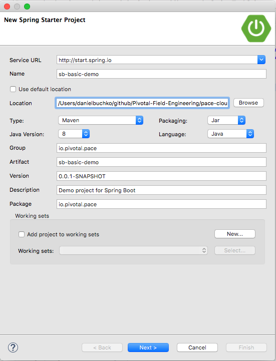
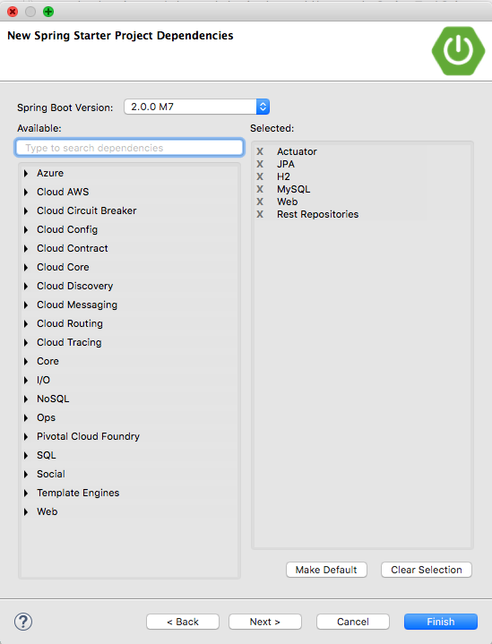
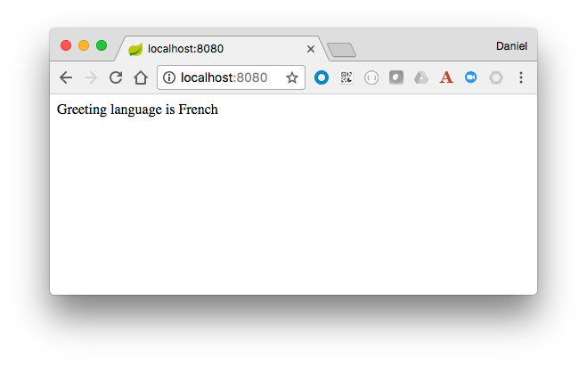
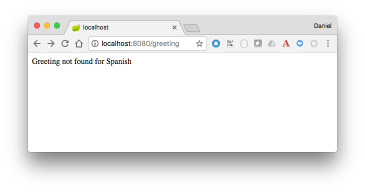
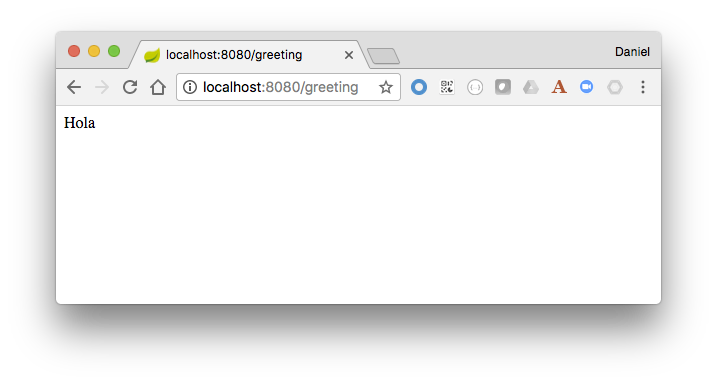
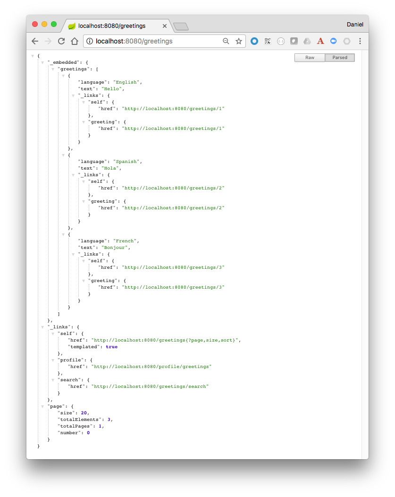
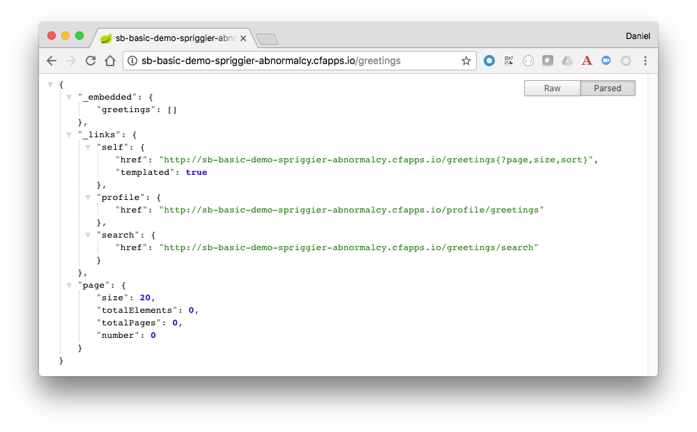
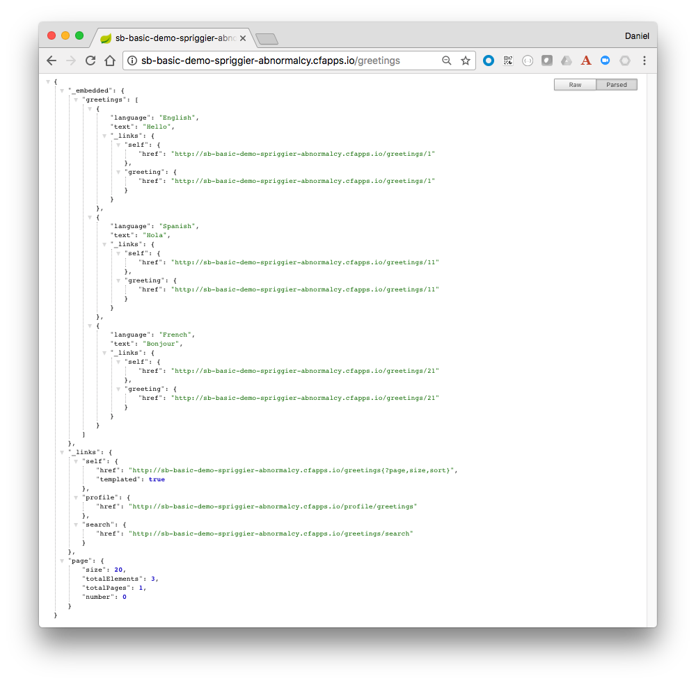

= PACE Cloud Native Developer Workshop

The purpose of this workshop is to introduce some basic features of Spring Boot, and deploy the resulting application to Pivotal Cloud Foundry.

== Creating a Basic Spring Boot application

. Navigate to http://start.spring.io/, and provide a general overview of the site.  Be sure to mention the following:
- Point out the site can generate Maven or Gradle projects
- It's possible to create shell projects for Java and other languages, and
- Click on the _Show Version_ link to display the full set of available options, directing attention to the numerous dependencies available.

. If it's not running already launch SpringSource Tool Suite (STS)

. `File` -> `New` -> `Spring Starter Project`.  Point out the *Service URL* is set to http://start.spring.io/.

. Use the following information to fill out the input fields (Other values take them as default). Click *Next* when done.

+
[options="header"]
[width="20%"]
|=======================
|Field|Value
|Name| *sb-basic-demo*
|Group| *io.pivotal.pace*
|Artifact| *sb-basic-demo*
|Package| *io.pivotal.pace*
|=======================

+

. Select `1.5.9.RELEASE`.

. Add the following dependencies: `Actuator`, `JPA`, `H2`, `MySQL`, `Web`, `Rest Repositories`. Click *Finish* when done.

+

. Open the `pom.xml` file, and draw attention to the included dependencies, relating them back to the ones selected in the Initializer.

+
.pom.xml
[source,xml]
----
<?xml version="1.0" encoding="UTF-8"?>
<project xmlns="http://maven.apache.org/POM/4.0.0" xmlns:xsi="http://www.w3.org/2001/XMLSchema-instance"
	xsi:schemaLocation="http://maven.apache.org/POM/4.0.0 http://maven.apache.org/xsd/maven-4.0.0.xsd">
	<modelVersion>4.0.0</modelVersion>

	<groupId>io.pivotal.pace</groupId>
	<artifactId>sb-basic-demo</artifactId>
	<version>0.0.1-SNAPSHOT</version>
	<packaging>jar</packaging>

	<name>sb-basic-demo</name>
	<description>Demo project for Spring Boot</description>

	<parent>
		<groupId>org.springframework.boot</groupId>
		<artifactId>spring-boot-starter-parent</artifactId>
		<version>1.5.9.RELEASE</version>
		<relativePath/> <!-- lookup parent from repository -->
	</parent>

	<properties>
		<project.build.sourceEncoding>UTF-8</project.build.sourceEncoding>
		<project.reporting.outputEncoding>UTF-8</project.reporting.outputEncoding>
		<java.version>1.8</java.version>
	</properties>

	<dependencies>
		<dependency>
			<groupId>org.springframework.boot</groupId>
			<artifactId>spring-boot-starter-actuator</artifactId>
		</dependency>
		<dependency>
			<groupId>org.springframework.boot</groupId>
			<artifactId>spring-boot-starter-data-jpa</artifactId>
		</dependency>
		<dependency>
			<groupId>org.springframework.boot</groupId>
			<artifactId>spring-boot-starter-data-rest</artifactId>
		</dependency>
		<dependency>
			<groupId>org.springframework.boot</groupId>
			<artifactId>spring-boot-starter-web</artifactId>
		</dependency>

		<dependency>
			<groupId>com.h2database</groupId>
			<artifactId>h2</artifactId>
			<scope>runtime</scope>
		</dependency>
		<dependency>
			<groupId>mysql</groupId>
			<artifactId>mysql-connector-java</artifactId>
			<scope>runtime</scope>
		</dependency>
		<dependency>
			<groupId>org.springframework.boot</groupId>
			<artifactId>spring-boot-starter-test</artifactId>
			<scope>test</scope>
		</dependency>
	</dependencies>

	<build>
		<plugins>
			<plugin>
				<groupId>org.springframework.boot</groupId>
				<artifactId>spring-boot-maven-plugin</artifactId>
			</plugin>
		</plugins>
	</build>

</project>
----

. Create an `SBController` class, and paste the following code into it:

+
.SBController.java
[source,java]
----
package io.pivotal.pace;

import java.util.List;

import org.springframework.beans.factory.annotation.Value;
import org.springframework.web.bind.annotation.RequestMapping;
import org.springframework.web.bind.annotation.RestController;

@RestController
public class SBController {

	private GreetingRepository greetingRepository;

	@Value("${greetingLanguage}")
	private String language;

	public SBController(GreetingRepository greetingRepository) {
		this.greetingRepository = greetingRepository;
	}

	@RequestMapping("/")
	public String greetingLanguage() {
		return "Greeting language is " + language;
	}

}
----

. Open the `SbBasicDemoApplicationTests` class in the `src/test/java` folder, and paste the following code into it:

+
.SbBasicDemoApplicationTests.java
[source,java]
----
package io.pivotal.pace;

import static org.assertj.core.api.Assertions.assertThat;

import org.junit.Test;
import org.junit.runner.RunWith;
import org.springframework.beans.factory.annotation.Autowired;
import org.springframework.boot.test.context.SpringBootTest;
import org.springframework.boot.test.context.SpringBootTest.WebEnvironment;
import org.springframework.boot.test.web.client.TestRestTemplate;
import org.springframework.test.context.junit4.SpringRunner;

@RunWith(SpringRunner.class)
@SpringBootTest(webEnvironment=WebEnvironment.RANDOM_PORT)
public class SbBasicDemoApplicationTests {

	@Autowired
	private TestRestTemplate restTemplate;

	@Test
	public void testHomePage() {
		String body = this.restTemplate.getForObject("/", String.class);
		assertThat(body).contains("Greeting");
	}

}
----

. In the `src/main/resources` directory, rename the `application.properties` file to `application.yml`, and paste in the following content:

+
.application.yml
[source,yaml]
----
greetingLanguage: English
----

. Run the application from the IDE, navigate to http://localhost:8080.

+
image:img/greeting-lang.png[]

. From the IDE, right-click on the `SbBasicDemoApplicationTests` class and run it as a J-Unit test.  The test should pass.

. Demonstrate building and running from the command line.  Emphasize the fact that an executable JAR is created, that can be run as a Java app from the command line.

+
[source,bash]
----
mvn clean package
.
.
.
java -jar target/sb-basic-demo-0.0.1-SNAPSHOT.jar
----

== Properties and Profiles

. Demonstrate how you can override property values in a Spring Boot application using environment variable settings.

+
From the command line, override the `greetingLanguage` property by setting the `GREETINGLANGUAGE` environment variable to `Spanish`.

+
[source,bash]
----
GREETINGLANGUAGE=Spanish java -jar target/sb-basic-demo-0.0.1-SNAPSHOT.jar
----

+
Emphasize the fact that this ability to override property values with environment variables will be important when we later deploy our application to PCF.

. Back in the IDE, add profile settings to the `application.yml` file.  The resulting file should have the following content.

+
.application.yml
[source,yaml]
----
greetingLanguage: English
---
spring:
  profiles: dev
greetingLanguage: French
---
spring:
  profiles: prod
greetingLanguage: Spanish
----

. Rebuild and launch the application again from the command line, this time changing the active profile and observing the result in the browser.

+
[source,bash]
----
java -jar target/sb-basic-demo-0.0.1-SNAPSHOT.jar --spring.profiles.active=dev
----

+

== Add a Database Repository

. Create a new `Greeting` domain object class, `Greeting.java` with the following content:

+
.Greeting.java
[source,java]
----
package io.pivotal.pace;

import javax.persistence.Entity;
import javax.persistence.GeneratedValue;
import javax.persistence.GenerationType;
import javax.persistence.Id;

@Entity
public class Greeting {

  @Id
  @GeneratedValue(strategy = GenerationType.AUTO)
  private Integer id;
  private String language;
  private String text;

  public Greeting(String language, String text) {
    super();
    this.language = language;
    this.text = text;
  }

  @Override
  public String toString() {
    return "Greeting [id=" + id + ", language=" + language + ", text=" + text + "]";
  }

  public Integer getId() {
	    return id;
	  }

  public String getLanguage() {
    return language;
  }

  public String getText() {
	    return text;
	  }

  public Greeting() {}
}
----

. Create a `GreetingRepository` class, which will be backed by a database.  Paste the following code into the `GreetingRepository.java` class.

+
.GreetingRepository.java
[source,java]
----
package io.pivotal.pace;

import org.springframework.data.jpa.repository.JpaRepository;
import java.util.List;
import org.springframework.data.repository.query.Param;

public interface GreetingRepository extends JpaRepository<Greeting, Integer> {
	  List<Greeting> findByLanguage(@Param("language") String language);
}
----

. Let's add a `greeting` endpoint to our `SBController` class to return the greeting from the repository, based on the language.  The resulting class should look as follows:

+
.SBController.java
[source,java]
----
package io.pivotal.pace;

import java.util.List;

import org.springframework.beans.factory.annotation.Value;
import org.springframework.web.bind.annotation.RequestMapping;
import org.springframework.web.bind.annotation.RestController;

@RestController
public class SBController {

	private GreetingRepository greetingRepository;

	@Value("${greetingLanguage}")
	private String language;

	public SBController(GreetingRepository greetingRepository) {
		this.greetingRepository = greetingRepository;
	}

	@RequestMapping("/")
	public String greetingLanguage() {
		return "Greeting language is " + language;
	}

	@RequestMapping("/greeting")
	public String greeting() {
		List<Greeting> greeting = greetingRepository.findByLanguage(language);
		if (greeting.isEmpty())
			return "Greeting not found for " + language;
		else
			return greeting.get(0).getText();
	}
}
----

. Add a property into the `application.yml` file to tell Spring to update (creating if necessary) the DB repository table on startup.  The resulting file should have the following content:

+
.application.yml
[source,yaml]
----
spring:
  jpa:
    properties:
      hibernate:
        dialect: org.hibernate.dialect.MySQL5Dialect
    hibernate:
      ddl-auto: update

greetingLanguage: English
---
spring:
  profiles: dev
greetingLanguage: French
---
spring:
  profiles: prod
greetingLanguage: Spanish
----

. Package and launch the app locally from the command line.

+
[source,bash]
----
mvn clean package
.
.
.
GREETINGLANGUAGE=Spanish java -jar target/sb-basic-demo-0.0.1-SNAPSHOT.jar
----

. Hit the http://localhost:8080/greeting endpoint, you'll see that we don't have any greetings yet.

+

. Let's add some greetings.  Create the following `create-greeting.sh` shell script.  Don't forget to make the script executable by executing the `chmod 755 create-greeting.sh` command.

+
.create-greetings.sh
[source,bash]
----
#!/bin/bash
#
# This script takes the app URL as the commandline parameter, and posts
# to the rest endpoint to create a set of greetings.
#

if [ -z "$1" ]; then
  echo "usage: $0 \<app URL (eg. http://my-app.cfapps.io)\>"
  exit
fi

url=$1

curl -i -X POST -H "Content-Type:application/json" -d "{ \"language\" : \"English\", \"text\" : \"Hello\" }" $url/greetings

curl -i -X POST -H "Content-Type:application/json" -d "{ \"language\" : \"Spanish\", \"text\" : \"Hola\" }" $url/greetings

curl -i -X POST -H "Content-Type:application/json" -d "{ \"language\" : \"French\", \"text\" : \"Bonjour\" }" $url/greetings
----

. Execute the script.

+
[source,bash]
----
./create-greetings.sh
----

. Now, let's see if we have any greetings by hitting the http://localhost:8080/greeting endpoint again.

+

. Finally, since we are using Spring Data Rest, we can query the repository as a native REST endpoint.  From the browser, navigate to `http://localhost:8080/greetings`.  Note that all the entries are visible in the greetings repository.

+

== Running on PCF

. Push the app to PCF.

+
[source,bash]
----
cf push sb-basic-demo -p target/sb-basic-demo-0.0.1-SNAPSHOT.jar --random-route
----

+
Walk the audience through the output of the push process, describing what is happening at various points.  Open the Apps Manager and provide a tour of the interface.  Examine the logs.

. Hit the application endpoint, demonstrating the app running now on PCF.

=== Manifests

. Extract the manifest for the app.

+
[source,bash]
----
cf create-app-manifest sb-basic-demo
----

+
Examine the contents of the manifest file.

+
.sb-basic-demo_manifest.yml
[source,yaml]
----
applications:
- name: sb-basic-demo
  disk_quota: 1G
  instances: 1
  memory: 1G
  routes:
  - route: sb-basic-demo-spriggier-abnormalcy.cfapps.io
  stack: cflinuxfs2
----

. Change the contents of the manifest file, setting the memory to 768M, and push the app again this time using the updated manifest file.

+
.sb-basic-demo_manifest.yml
[source,yaml]
----
applications:
- name: sb-basic-demo
  disk_quota: 1G
  instances: 1
  memory: 768M
  routes:
  - route: sb-basic-demo-spriggier-abnormalcy.cfapps.io
  stack: cflinuxfs2
----

+
[source,bash]
----
cf push -f sb-basic-demo_manifest.yml
----

. Point out the updated memory setting in the Apps Manager.

=== Create and Bind a MySQL Service

. Create a MySQL service instance, and bind the app to it.  In another terminal window, tail the logs of the app as you restart it.

+
[source,bash]
----
cf create-service cleardb spark demo-db
cf bind-service sb-basic-demo demo-db
cf restart sb-basic-demo
----

. Hit the REST repository endpoint to demonstrate no greetings are currently in the database.

+

. Run the script to populate the greeting entries in the MySQL database, substituting your app URL endpoint accordingly.

+
[source,bash]
----
./create-greetings.sh http://sb-basic-demo-spriggier-abnormalcy.cfapps.io
----

. Refresh the browser page to demonstrate the repository has now been populated.

+

. Restart the application and verify that the repository is still being populated from the persistent MySQL service.

+
[source,bash]
----
cf restart sb-basic-demo
----

=== Scale the application

Scale the application out to 2 instances.  Hit the app from the browser, and in another window or tab navigate to the `Trace` tab of the application in the Apps Manager to demonstrate the requests alternating betweeen application instances.
